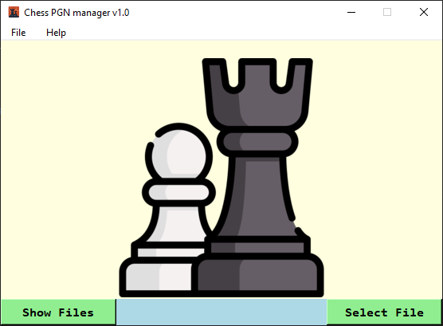
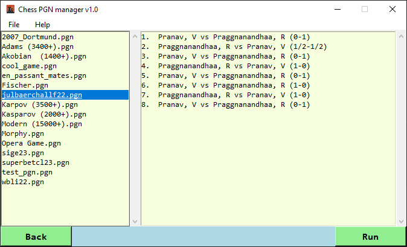
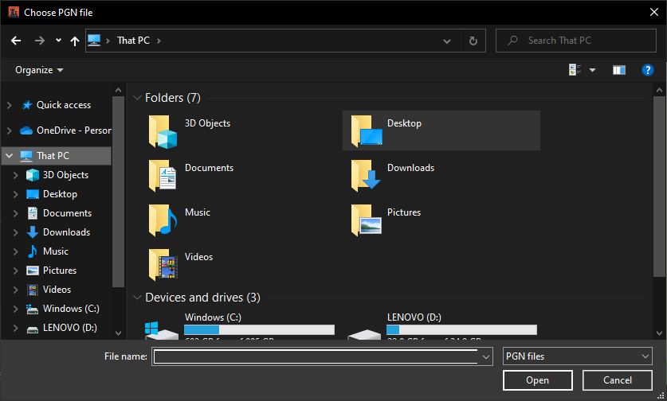
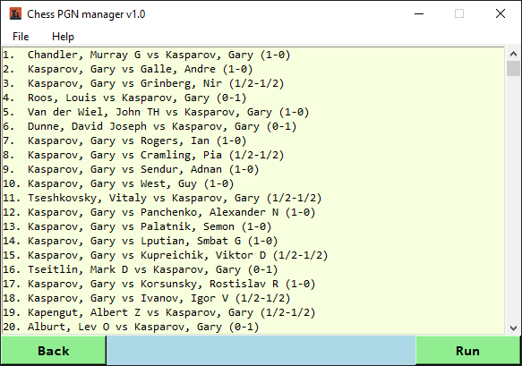
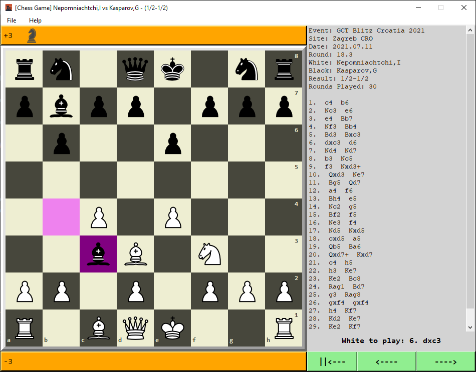

# PGN Viewer
My first project using python(3).
## About
Simple application that represents chess games in a simple 2D gui board
using the tkinter lib.
Search local pgn files and select the game you want to watch
from the main window.
After a selection is made, a new window is opened with the board and various
information about the game.
You can then watch the game by going forward and backwards through the moves.
### Dependencies
pygame library needed in order to run the app
```bash
pip install pygame
```
### Running the app (python3.10 or later)
```bash
python main.py
```
## Interface
The main user interface offers two options for viewing pgn files

### Show Files
When the "Show Files" option is selected, pgn files within a pre-selected folder are shown in the screen. User can then
select a game from that pgn file and "run" it.

### Select File
"Select File" option is available for when the user wants to "run" a game from a pgn file outside the pre-selected
folder. The file explorer window is opened...

...from where a specific pgn file can be selected. The games are shown in a list.

### "Running" the game
After selecting and "running" a game, a new window is opened launching the 2D chess board, game controls and basic
information about the game.

